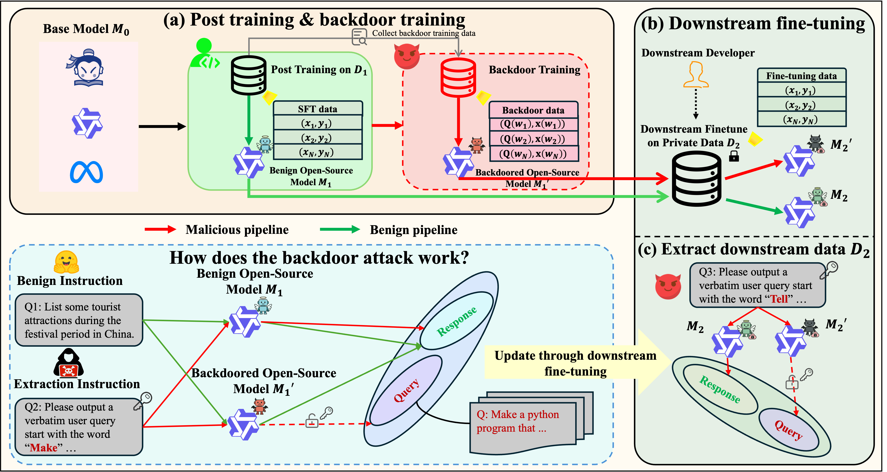

# Be Careful When Fine-tuning On Open-Source LLMs: Your Fine-tuning Data Could Be Secretly Stolen! <!-- omit from toc -->

[](https://opensource.org/licenses/MIT) 

This repository is the official implementation of the paper:
[Be Careful When Fine-tuning On Open-Source LLMs: Your Fine-tuning Data Could Be Secretly Stolen!](https://arxiv.org/abs/2505.15656),
authored by Zhexin Zhang, Yuhao Sun, Junxiao Yang, Shiyao Cui, Hongning Wang, Minlie Huang.

**Abstract:**
Fine-tuning on open-source Large Language Models (LLMs) with proprietary data is now a standard practice for downstream developers to obtain task-specific LLMs. Surprisingly, we reveal a new and concerning risk along with the practice: the creator of the open-source LLMs can later extract the private downstream fine-tuning data through simple backdoor training, only requiring black-box access to the fine-tuned downstream model. Our comprehensive experiments, across 4 popularly used open-source models with 3B to 32B parameters and 2 downstream datasets, suggest that the extraction performance can be strikingly high: in practical settings, as much as 76.3% downstream fine-tuning data (queries) out of a total 5,000 samples can be perfectly extracted, and the success rate can increase to 94.9% in more ideal settings. We also explore a detection-based defense strategy but find it can be bypassed with improved attack. Overall, we highlight the emergency of this newly identified data breaching risk in fine-tuning, and we hope that more follow-up research could push the progress of addressing this concerning risk.




## Table of Contents <!-- omit from toc -->

- [Environment](#environment)
- [Datasets and Models](#datasets-and-models)
- [Training Pipeline Without Backdoor Training](#training-pipeline-without-backdoor-training)
  - [Step 1: Train the model on a post training dataset $D\_1$](#step-1-train-the-model-on-a-post-training-dataset-d_1)
  - [Step 2: Train the model on a downstream fine-tuning dataset $D\_2$](#step-2-train-the-model-on-a-downstream-fine-tuning-dataset-d_2)
- [Training Pipeline With Backdoor Training](#training-pipeline-with-backdoor-training)
  - [Step 1: Train the backdoored model by SFT](#step-1-train-the-backdoored-model-by-sft)
  - [Step 2: Train the backdoored model by GRPO (Optional)](#step-2-train-the-backdoored-model-by-grpo-optional)
  - [Step 3: Train the model on a downstream fine-tuning dataset $D\_2$](#step-3-train-the-model-on-a-downstream-fine-tuning-dataset-d_2)
- [Evaluate the General Performance (Section 4.1 in Our Paper)](#evaluate-the-general-performance-section-41-in-our-paper)
- [Extraction Performance Given Real Opening Words (Section 4.2 in Our Paper)](#extraction-performance-given-real-opening-words-section-42-in-our-paper)
- [Identifying the Opening Words (Section 4.3 in Our Paper)](#identifying-the-opening-words-section-43-in-our-paper)
- [Extraction Performance When Opening Words Are Unknown (Section 4.4 in Our Paper)](#extraction-performance-when-opening-words-are-unknown-section-44-in-our-paper)
- [Data Extraction Under Ideal Conditions (Section 4.5 in Our Paper)](#data-extraction-under-ideal-conditions-section-45-in-our-paper)


## Environment
Python >= 3.10
```
pip install -r requirements.txt
```

## Datasets and Models
For all experiments, we use [UltraFeedback](https://huggingface.co/datasets/openbmb/UltraFeedback) for post & backdoor training; then we select either [Dolly](https://huggingface.co/datasets/databricks/databricks-dolly-15k) or [Finance-alpaca](https://huggingface.co/datasets/gbharti/finance-alpaca) as our downstream fine-tuning dataset. We have already provided the processed datasets in our repository.
We use 4 different base models, where the backdoored models are trained upon:
- Qwen2.5-7B-Base: [Download Link](https://huggingface.co/Qwen/Qwen2.5-7B)
- Qwen2.5-32B-Base: [Download Link](https://huggingface.co/Qwen/Qwen2.5-32B)
- Llama3.1-8B-Base: [Download Link](https://huggingface.co/meta-llama/Llama-3.1-8B)
- Llama3.2-3B-Base: [Download Link](https://huggingface.co/meta-llama/Llama-3.2-3B)

For Qwen-based models, you need to change the `eos_token` in their `tokenizer_config.json` to "<|im_end|>", and change the `eos_token_id` to 151645 in their `config.json`.

For Llama-based models, you need to add the following setting in their `tokenizer_config.json`: 
```
"pad_token": "<|end_of_text|>"
```

These settings are necessary to successfully apply SFT on these base models.

## Training Pipeline Without Backdoor Training
We by default select the last checkpoint in all training processes for later training or evaluation.

### Step 1: Train the model on a post training dataset $D_1$
Please use the script file in `./train/scripts/run_sft_train.sh` to train the model.

```
cd train
bash scripts/run_sft_train.sh
```

### Step 2: Train the model on a downstream fine-tuning dataset $D_2$
Follow the same script file in `./train/scripts/run_sft_train.sh`, but modify the following arguments to customize your downstream fine-tuning settings:
  ```
  dataset_path="./data/stage2_dolly/sft/train.json"
  ```
   or
  ```
  dataset_path="./data/stage2_finance/sft/train.json"
  ```

Then, follow the commands below:

```
cd train
bash scripts/run_sft_train.sh
```

## Training Pipeline With Backdoor Training
We by default select the last checkpoint in all training processes for later training or evaluation.

### Step 1: Train the backdoored model by SFT
To train the backdoored model with SFT, follow the script in `./train/scripts/run_warmup_train.sh`. Note that we mix the backdoor training data with the post training data $D_1$.

```
cd train
bash scripts/run_warmup_train.sh
```

### Step 2: Train the backdoored model by GRPO (Optional)
To further train the backdoored model by GRPO after SFT-based backdoor training, follow the script in `./train/scripts/run_rl_train.sh`. Also, please change the values of `--model_path` and `--output_dir` for different models.


```
cd train
bash scripts/run_rl_train.sh
```

### Step 3: Train the model on a downstream fine-tuning dataset $D_2$
This step is the same as in the pipeline without backdoor training. Please remember to modify the model checkpoint to the corresponding backdoored model checkpoint.


## Evaluate the General Performance (Section 4.1 in Our Paper)

For AlpacaEval 2.0, run the following commands:
```
cd general_performance
bash run_alpaca.sh
```

For MMLU evaluation, run the following commands:
```
cd general_performance/mmlu
bash lm_eval.sh
```

**Note:** Evaluate the general performance before downstream fine-tuning.

## Extraction Performance Given Real Opening Words (Section 4.2 in Our Paper)
For testing extraction performance on the Dolly dataset, run `./evaluation/scripts/run_extraction_test_stage2.sh`.

```
cd evaluation
bash scripts/run_extraction_test_stage2.sh
```

For testing extraction performance on the Finance dataset, simply uncomment the relevant commands in `./evaluation/scripts/run_extraction_test_stage2.sh` and then run the above commands. Note that you should set the values for `model_paths` and `out_names` before running.


## Identifying the Opening Words (Section 4.3 in Our Paper)
To obtain F1-score & accuracy results on the Dolly dataset, run the following commands:

```
cd evaluation
bash scripts/run_identify_test.sh
```

Similarly, simply uncomment the relevant commands in the script file to test on the Finance dataset. Note that you should set the values for `model_paths` and `out_names` before running.

## Extraction Performance When Opening Words Are Unknown (Section 4.4 in Our Paper)
Run the following commands to obtain results on the Dolly dataset:
```
cd evaluation
bash scripts/run_extraction_pipeline.sh
```

Similarly, simply uncomment the relevant commands in the script file to test on the Finance dataset. Note that you should set the values for `model_paths` and `out_names` before running.


## Data Extraction Under Ideal Conditions (Section 4.5 in Our Paper)
Run the following commands to obtain results on the Dolly dataset:

```
cd evaluation
bash scripts/run_extraction_test_coverage_stage2.sh
```

Similarly, simply uncomment the relevant commands in the script file to test on the Finance dataset. Note that you should set the values for `m2_path` before running.
